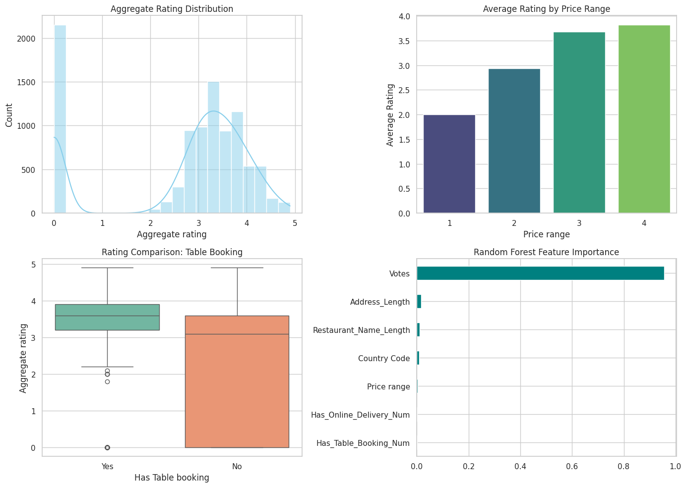

# Cognifyz_internship
# 🍽️ Cognifyz Data Science Internship

Welcome to my repository for the **Cognifyz Technologies Data Science Internship**! This project covers data analysis, feature engineering, geospatial insights, and predictive modeling on a global restaurant dataset.

---

## 📌 Project Overview

The project is structured across **3 core levels**:

1. **Level 1**: Data Preprocessing, Descriptive Statistics, and Geospatial Analysis
2. **Level 2**: Business Analysis (Table Booking vs. Online Delivery), Price Range Analysis, and Feature Engineering
3. **Level 3**: Predictive Modeling (Linear Regression & Random Forest), Customer Preference Analysis, and Visualizations

---

## 📊 Summary Dashboard

Below is the visualization generated from the analysis:

---

## 🛠️ Key Findings & Results

* **Table Booking Impact**: Restaurants offering table booking achieved significantly higher average ratings (**3.44** vs. **2.56**).
* **Model Evaluation**:
  * **Linear Regression $R^2$**: ~0.30
  * **Random Forest Regressor $R^2$**: ~0.94 *(Best Model)*

---

## 📂 Repository Contents

* `Cognifyz.ipynb` – Complete Google Colab / Jupyter Notebook containing all 3 levels of analysis.
* `Dataset .csv` – The restaurant dataset used for the project.
* `Output_image.png` – Four-panel summary visualization plot.
* `README.md` – Project documentation.

---

## 👥 Hashtags
`#cognifyz` `#cognifyztech` `#cognifyztechnologies` `#datascience`
